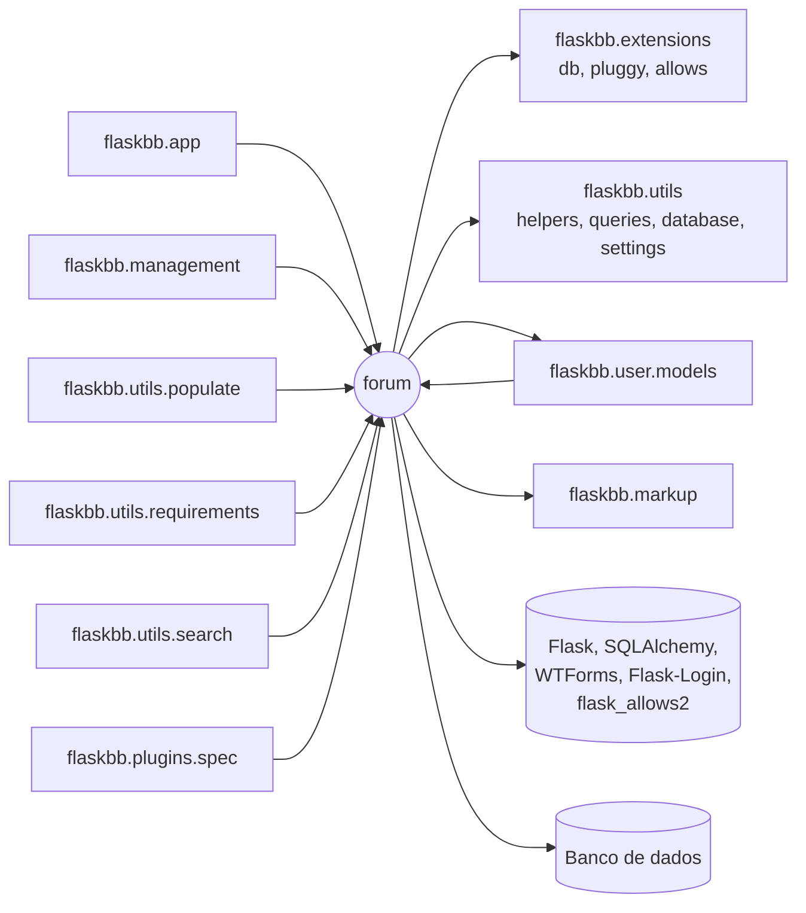

# Análise do sistema legado — `flaskbb/forum/`

## Dependências

O módulo é importado pela aplicação (registro do blueprint), pelo painel `management`, pelo módulo `user`, pelos utilitários de população do banco, de permissões e de busca e pela especificação de plugins. Ele depende das extensões globais (`db`, `pluggy`, `allows`), dos utilitários transversais, do módulo `user` e do renderizador de Markdown. A seta nos dois sentidos entre `forum` e `user.models` indica uma dependência cíclica.

## Acoplamento e coesão

1. **Dependência cíclica com `user`.** `user/models.py:31` importa `Forum`, `Post` e `Topic`, e `forum/models.py` precisa de `User` e `Group`. Para não quebrar a importação, `User`/`Group` são importados dentro de funções em sete pontos (`models.py:712, 1003, 1079, 1356, 1531, 1577, 1645`). Qualquer mudança em um dos dois módulos pode afetar o outro.
2. **Persistência acoplada ao domínio.** Os modelos acessam `db.session` e fazem `commit` diretamente em 18 pontos de `models.py` (por exemplo, `Post.save` em 307 e 338 e `Topic.save` em 903 e 917), e as views também consultam o banco diretamente (`views.py:91-98`, `389`, `420`). Não é possível testar ou reaproveitar as regras sem um banco configurado.
3. **Baixa coesão em `ManageForum.post`** (`views.py:412-538`). Um único método de cerca de 125 linhas trata travar, destravar, destacar, trivializar, excluir, ocultar, reexibir e mover tópicos em uma cadeia de `if`, com 13 chamadas a `flash`. O próprio código desliga o alerta de complexidade com `# noqa: C901`.

## Pontos de fragilidade

1. **Último post duplicado em vários lugares.** As cinco colunas de "último post" do fórum são reescritas manualmente em pelo menos sete trechos (`models.py:327, 433-439, 534, 991-997, 1060, 1198-1206` e `forms.py:140`). Esquecer uma delas em uma alteração deixa a página do fórum com dados inconsistentes.
2. **`Topic.save` não é atômico** (`models.py:866-917`). O tópico é gravado com um `commit` (903) antes de o primeiro post ser salvo, e há outro `commit` no final (917). Uma falha no meio deixa um tópico sem post inicial.
3. **Código morto em `_restore_post_to_topic`** (`models.py:525`). A linha `self.second_last_post = last_unhidden_post  # TODO` cria um atributo solto em `Post` que nunca é lido (`second_last_post` pertence a `Topic` e retorna um id). Isso confunde quem mantém o método e esconde a intenção original.

## Lei de Lehman

O histórico do Git evidencia a **Lei do Crescimento Contínuo**: o projeto começou em 11/09/2013 e `forum/models.py` passou de 461 linhas (fim de 2013) para 1.019 (2015), 1.329 (2018) e 1.665 linhas hoje, enquanto `views.py` foi de 325 para 1.327. Também aparece a **Lei da Complexidade Crescente**: as funcionalidades foram acumuladas nos mesmos arquivos, o que resultou em métodos longos e no `# noqa: C901` de `ManageForum.post`. Por fim, a **Lei da Mudança Contínua** fica visível no padrão dos commits: 109 commits no módulo em 2014, quase nenhum entre 2019 e 2024 (4, 2 e 2) e um novo pico de 17 em 2026, quando foi preciso migrar para SQLAlchemy 2.0 e Flask-Allows2 apenas para o sistema continuar funcionando com dependências atuais.

## Seams

1. **Métodos de consulta dos modelos** (`Topic.get_topic`, `Topic.get_posts`, `Forum.get_forum`, `Forum.get_topics`, em `models.py:700, 711, 1404, 1440`). As views já buscam dados por esses métodos de classe. Colocá-los atrás de uma interface de repositório permitiria usar uma implementação em memória nos testes e a atual em produção.
2. **Relógio (`time_utcnow`)**. O horário é obtido chamando `time_utcnow()` diretamente em vários pontos (`models.py:314, 655, 740, 899, 1240`), o que afeta criação de posts e regras de "não lido". Receber o relógio como dependência (ou por um ponto único de acesso) permitiria testar fronteiras de tempo, como o `TRACKER_LENGTH`, com um relógio controlado.
