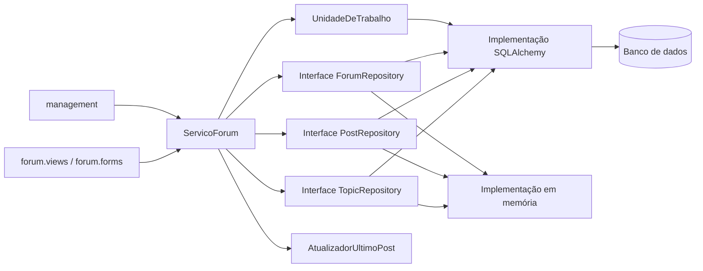

# Proposta de evolução — camada de repositórios para `flaskbb/forum/`

## Motivação

A análise mostrou que os modelos do módulo `forum` misturam regra de negócio com acesso direto ao banco: há 18 `commit` espalhados em `models.py`, as views também consultam `db.session` e as colunas de "último post" do fórum são atualizadas manualmente em pelo menos sete trechos. Isso torna o código difícil de testar sem banco, favorece inconsistências (fragilidade 1) e permite estados parciais, como o `Topic.save` com dois `commit` (fragilidade 2).

Propõe-se introduzir uma **camada de repositórios** que isole o SQLAlchemy e concentre as gravações e o controle de transação. Ela aproveita o seam já existente nos métodos de consulta (`get_topic`, `get_posts`, `get_forum`, `get_topics`) e é compatível com os contratos documentados em `MODULO.md`: a interface pública usada pelas views e pelos outros módulos é preservada durante toda a transição.

## Estado-alvo

## Novos artefatos

- `forum/repositorios/contratos.py`: interfaces (`Protocol`) `TopicRepository`, `PostRepository` e `ForumRepository`, com apenas os métodos usados hoje.
- `forum/repositorios/sqlalchemy.py`: implementação que reaproveita as consultas atuais dos modelos.
- `forum/repositorios/memoria.py`: implementação em memória para testes.
- `forum/unidade_trabalho.py`: controla a transação, com um único `commit` por operação.
- `forum/servico.py` (`ServicoForum`): orquestra criar tópico, responder, ocultar, excluir e mover.
- `forum/ultimo_post.py` (`AtualizadorUltimoPost`): ponto único para as colunas `last_post_*`.
- Testes de contrato executados contra as duas implementações.

## Plano de migração incremental

1. **Caracterizar o comportamento atual.** Adicionar testes para as fronteiras de último post, contagens e ocultação (excluir o último post do fórum, ocultar o primeiro post, reexibir um post). O código não muda; o sistema continua igual. A suíte ampliada passa a ser a rede de segurança.
2. **Centralizar o "último post".** Criar `AtualizadorUltimoPost` e fazer os sete trechos duplicados chamarem esse ponto único, um de cada vez. Os modelos continuam gravando como antes, só delegando a cópia das colunas. Os testes do passo 1 verificam que nada mudou.
3. **Definir contratos e adaptador SQLAlchemy.** Criar as interfaces e uma implementação que apenas delega aos métodos de classe atuais (`get_topic`, `get_forum` etc.). Nenhum chamador muda ainda. Testes de contrato verificam o adaptador contra os mesmos dados.
4. **Migrar as leituras das views.** Fazer as views buscarem dados pelos repositórios, rota por rota, mantendo os métodos antigos disponíveis. Um parâmetro de configuração permite voltar ao caminho antigo. Testes de view comparam o HTML/status das rotas antes e depois.
5. **Migrar as escritas com unidade de trabalho.** Mover a gravação de `Topic.save`, `Post.save`, `hide` e `delete` para `ServicoForum`, com um único `commit` por operação. Os métodos antigos passam a chamar o serviço, então `management` e `user` continuam funcionando sem mudanças. Testes verificam que uma falha no meio não deixa tópico sem post.
6. **Remover o acesso direto ao banco nos modelos.** Quando nenhuma chamada usar mais o caminho antigo (verificado por busca no código e por um aviso `FlaskBBDeprecation`), retirar os `commit` dos modelos e as consultas diretas das views. A suíte completa e os testes de contrato validam a remoção.

## Riscos e mitigação

| Risco | Mitigação |
|---|---|
| Plugins dependerem da ordem dos eventos `pluggy` (`*_save_before/after`) | Manter a emissão dos eventos nos mesmos momentos e cobrir a ordem com testes que usam dublês do `pluggy`. |
| Diferença de comportamento entre as implementações em memória e SQL | Testes de contrato idênticos para as duas; a de memória só é usada em testes. |
| A dependência cíclica com `user` impedir a separação | Os repositórios recebem e devolvem objetos do domínio sem importar `user` no nível do módulo; a quebra do ciclo é feita aos poucos, no passo 3. |

## Fora do escopo

Não serão alterados os templates, as rotas e URLs, o esquema do banco, as regras de permissão (`flask_allows2`), a busca (Whooshee) nem os módulos `management` e `user`, além do necessário para chamar o serviço. A proposta não transforma o fórum em um serviço separado nem troca o SQLAlchemy por outra tecnologia.
